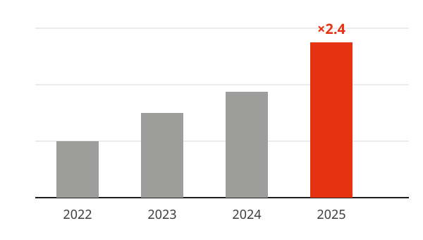

<!-- layout: toc -->

---

# Basics

Slides are separated by a line containing only `---`.

---

## Text, lists and emphasis

- A line starting with `## ` becomes the **slide title**
- `**bold**` is rendered in **Inria red**, `*italic*` stays *neutral*
- ==Highlighted== text with `==…==`, `inline code`, [links](https://inria.fr)
  - Nested items get a grey marker
  - and a slightly smaller size
1. Numbered lists
2. get red numbers

Note:
Everything after a line with "Note:" is a speaker note.
Press **S** to open the presenter view.

---

<!-- kicker: Layout -->
<!-- cols: 55/45 -->

## Two columns with `|||`

Put a line containing only `|||` between columns.

- Widths via `<!-- cols: 55/45 -->`
- Any content works in a column

|||



---

## Boxes

::: block Main result
Fenced `:::` containers create boxes, like Beamer blocks.
:::

|||

::: alert
Default titles come from the box kind (`alert`, `example`, `theorem`…).
:::

::: example
Localised in French with `lang: fr`.
:::

---

## Mathematics

Inline math such as $e^{i\pi} + 1 = 0$, and display math:

$$
\mathcal{L}(\theta) = \sum_{i=1}^{n} \log p_\theta(x_i) - \lambda \lVert \theta \rVert_2^2
$$

::: theorem (Cauchy–Schwarz)
For all $u, v$ in an inner product space, $|\langle u, v\rangle| \le \lVert u\rVert \, \lVert v\rVert$.
:::

::: proof
Expand $\lVert u - t v \rVert^2 \ge 0$ and take the discriminant.
:::

---

## Code

```python
import torch

def train(model, loader, epochs: int = 10):
    """Minimal training loop."""
    opt = torch.optim.AdamW(model.parameters(), lr=3e-4)
    for epoch in range(epochs):
        for x, y in loader:
            loss = model(x).cross_entropy(y)  # forward
            loss.backward()
            opt.step(); opt.zero_grad()
```

---

## Tables

| Method        | Accuracy | Time (s) |
|:--------------|---------:|---------:|
| Baseline      |    81.2 % |     12.0 |
| Prior work    |    84.7 % |     30.5 |
| **Ours**      | **88.9 %** |  **9.8** |

<small>Numbers are illustrative.</small>

---

# Going further

Incremental reveals, images, special layouts.

---

<!-- incremental -->

## Incremental lists

- Add `<!-- incremental -->` to a slide
- Each top-level item appears
- one at a time

<!-- pause -->

Or put `<!-- pause -->` between blocks to reveal them in steps.

---


## Split image

`` puts a full-height image on the right,
and the content flows in the remaining space.

- ``, `` for full-bleed
- `` / `` to size inline images

---

<!-- bg: dark -->


## Full-bleed background

With `<!-- bg: dark -->` a gradient keeps text readable.

---

<!-- layout: statement -->

Big **statements** for the one idea people should remember.

<small>`<!-- layout: statement -->`</small>

---

> The purpose of computing is insight, not numbers.

— Richard Hamming

---

## Key figures

<!-- cols: 1/1/1 -->

::: stat 42
papers published
:::

|||

::: stat 1.3 M
lines of open-source code
:::

|||

::: stat ×2.4
speed-up over baseline
:::

---

<!-- layout: end -->

# Thank you

The source of this deck is `slides/guide.md`
